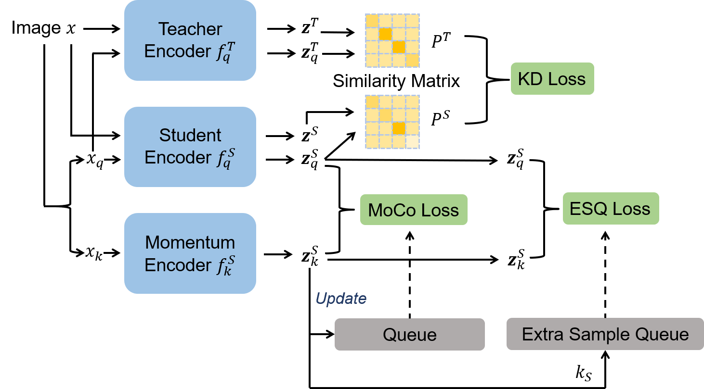

## Continual Contrastive Learning for Image Classification

This is the implementation of the [Continual Contrastive Learning for Image Classification](https://arxiv.org/abs/2107.01776)

<p align="center">
  
</p>


## Preparation

Install PyTorch and ImageNet dataset following the [official PyTorch ImageNet training code](https://github.com/pytorch/examples/tree/master/imagenet).

Install other package:

```
pip install -r requirements.txt
```


## Incremental Self-supervised Training

This implementation only supports **multi-gpu**, **DistributedDataParallel** training, which is faster and simpler; single-gpu or DataParallel training is not supported.

To do incremental self-supervised pretraining of a ResNet-50 model on ImageNet in an 8-gpu machine, run:

```
python train.py \
	-a resnet50 \
	--lr 0.03 \
	--batch-size 256 \
	--dist-url 'tcp://localhost:10002' --multiprocessing-distributed --world-size 1 --rank 0 \
	--mlp --moco-t 0.2 --aug-plus --cos \
	--data <your imagenet-folder with train and val folders> \
	--method <one method of [CLL, Finetuning, SimpleReplay]> \
	--n_tasks <number of incremental steps, default=10> \ 
	--n_save <number of images to save in each incremental step, default=20>
```

if you want to train the model on ImageNet-Sub, run:

```
python train.py \
	-a resnet50 \
	--lr 0.03 \
	--batch-size 256 \
	--dist-url 'tcp://localhost:10002' --multiprocessing-distributed --world-size 1 --rank 0 \
	--mlp --moco-t 0.2 --aug-plus --cos \
	--data <your imagenet-folder with train and val folders> \
	--method <one method of [CLL, Finetuning, SimpleReplay]> \
	--n_tasks <number of incremental steps, default=10> \ 
	--n_save <number of images to save in each incremental step, default=20> \
	--imagenetsub
```

## Linear Evaluation

With a pre-trained model, to train a supervised linear classifier on frozen features/weights in an 8-gpu machine, run:

```
python lincls_eval.py \
	-a resnet50 \
	--lr 30.0 \
	--batch-size 256 \
	--pretrained <your pretrained model> \
	--dist-url 'tcp://localhost:10002' --multiprocessing-distributed --world-size 1 --rank 0 \
	--data <your imagenet-folder with train and val folders>
```

If you want to evaluate the model on ImageNet-Sub, run:

```
python lincls_eval.py \
	-a resnet50 \
	--lr 30.0 \
	--batch-size 256 \
	--pretrained <your pretrained model> \
	--dist-url 'tcp://localhost:10002' --multiprocessing-distributed --world-size 1 --rank 0 \
	--data <your imagenet-folder with train and val folders> \
	--imagenetsub
```

if you want to evaluate the momentum teacher model, run:

```
python lincls_eval.py \
	-a resnet50 \
	--lr 30.0 \
	--batch-size 256 \
	--pretrained <your pretrained model> \
	--dist-url 'tcp://localhost:10002' --multiprocessing-distributed --world-size 1 --rank 0 \
	--data <your imagenet-folder with train and val folders> \
	--use_teacher_weight True
```

**Note:** The momentum teacher performance better than student of CCL method on ImageNet-Full.


## Results

We implementation the results on ImageNet-Sub under 10 incremental steps:

|    Method    | Accuracy (this code) | Accuracy (paper) |
| :----------: | :------------------: | :--------------: |
|  Finetuning  |        53.06         |      52.62       |
| SimpleReplay |        54.36         |      54.28       |
|  CCL (our)   |        55.54         |      55.48       |

## License

The project is only free for academic research purposes, but needs authorization for commerce. For commerce permission, please contact [wyt@pku.edu.cn](mailto:wyt@pku.edu.cn).

## Citation

If you use our code/model/data, please cite our paper:

```
@Article{lin2021ccl,
  author  = {Zhiwei Lin and Yongtao Wang and Hongxiang Lin},
  title   = {Continual Contrastive Learning for Image Classification},
  journal = {arXiv preprint arXiv:2107.01776},
  year    = {2021},
}
```

